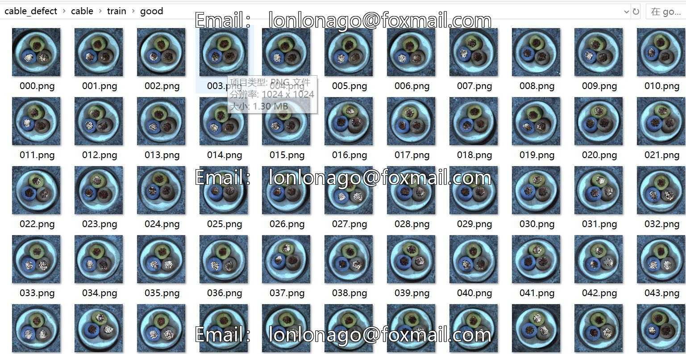
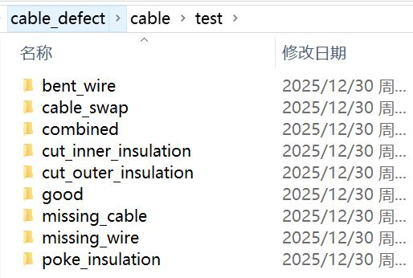
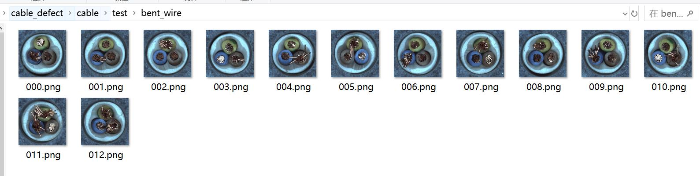
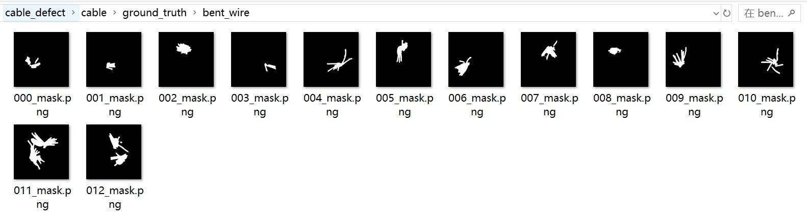

# Industrial Cable Defect Dataset with 374 Images in 8 Categories for Segmentation or Classification

cable/  
├── train/  
│  └── good/    # 224 Good Training Images  
└── test/  
├── good/    # 58 Good Test Images  
├── bent_wire/  # 14 Bent Wires  
├── cable_swap/  # 14 Cable Swaps  
├── combined/    # 13 Combined Images  
├── cut_inner_insulation/ # 16 Cut Inner Insulation Images  
├── cut_outer_insulation/ # 12 Cut Outer Insulation Images  
├── missing_cable/ # 14 Missing Cable Images  
├── missing_wire/  # 11 Missing Wires  
└── poke_insulation/ # 12 Poked Insulation Images  
Defect Types:
bent_wire: Bending of the wire  
cable_swap: Using the wrong cable  
combined: Multiple defects  
cut_inner_insulation: Damage to the inner insulation layer  
cut_outer_insulation: Damage to the outer insulation layer  
missing_cable: Lack of cable  
missing_wire: Lack of wire  
poke_insulation: Holes in the insulation layer

## Image

Here is a pay link on Stripe ( https://buy.stripe.com/3cs8yP7sY87d0vu9AB ). Please contact me lonlonago@foxmail.com after funding $89, and I will send you a complete data files , thank you!

